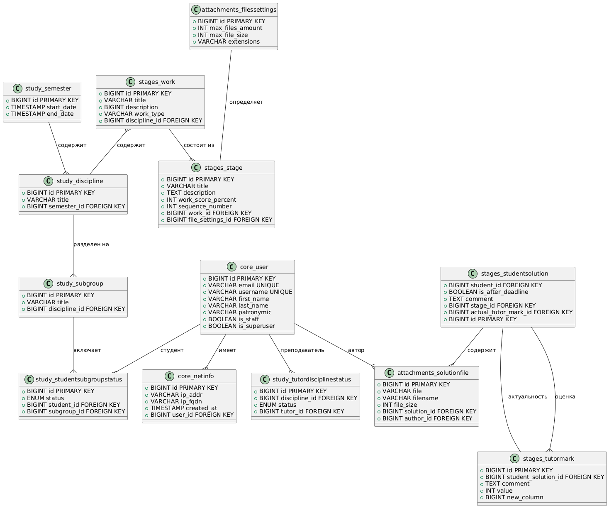
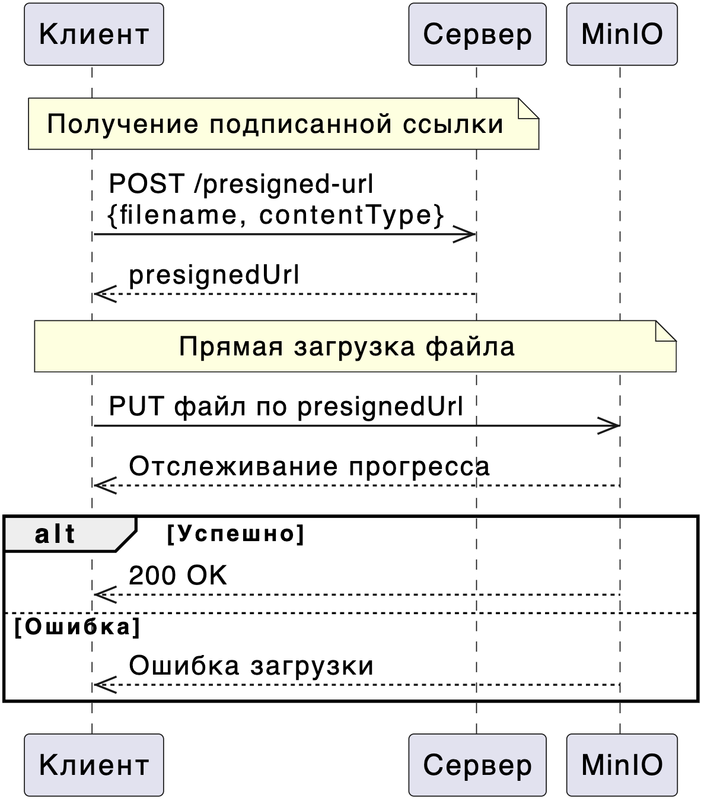

### Запуск MinIO s3
`mc alias set kraminio http://localhost:9000 admin access_key`
Added `kraminio` successfully.

`mc admin policy create kraminio newPolicy opt/policies/kra.json`
Created policy `newPolicy` successfully.

`mc admin user add kraminio kra access_key`
Added user `kra` successfully.

`mc admin policy attach kraminio newPolicy --user=kra`
Policy `newPolicy` successfully attached to user `kra`

`mc admin user list kraminio`
enabled kra newPolicy

`mc mb kraminio/kra`
Bucket created successfully `kraminio/kra`.

### База данных

### Загрузка файлов пользователем
